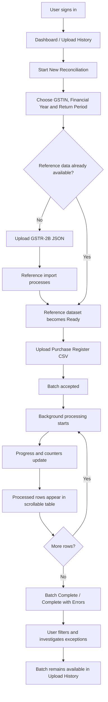
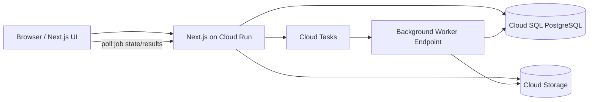

# Product Requirements Document (PRD)
# ClearTax Bulk Invoice Reconciliation

**Team:** Team-07  
**Team Members:** Garvit Singh (Backend & Database), Edha Singh (Frontend)  
**PRD Submission Date:** 21 August 2026  
**Target Product Completion Date:** 16 September 2026  
**Document Version:** 1.0  
**Last Updated:** 20 August 2026  
**Status:** Ready for PRD submission  

---

## 1. Executive Summary

ClearTax users such as accountants, GST executives, finance teams, and tax professionals may need to reconcile thousands of purchase invoices against GST-side reference data. Manually checking each invoice is slow, repetitive, error-prone, and unsuitable for high-volume workflows.

This project will build a **bulk invoice reconciliation workflow** in which a user can:

1. Sign in to the application.
2. Select the business and GST return period.
3. Import **GSTR-2B reference data** for that period.
4. Upload a **Purchase Register CSV** containing many invoices.
5. Submit the batch without waiting for all invoices to process inside the upload request.
6. View durable background-processing progress.
7. See processed rows appear in a scrollable results table.
8. Identify each row as **Matched**, **Mismatched**, or **Error**.
9. See the reason for a mismatch or row-level failure.
10. Refresh or revisit the page without losing the running job.
11. View previous upload/reconciliation batches in upload history.

The defining reliability requirement is:

> **One bad invoice row must never stop the remaining valid rows from being processed.**

The MVP will use **manually imported GSTR-2B JSON downloaded from the GST Portal** as the reference source. Direct live GSTN fetching is explicitly **not an MVP dependency**, because production third-party GST API access requires an authorized GSP/ASP-style integration arrangement. The system will be designed so a live GST connector can replace the manual reference-import step later without changing the reconciliation model.

---

## 2. Original Problem Statement

> ClearTax wants a bulk invoice upload (CSV) that processes in the background and shows progress. Processed invoices appear in a scrollable table with match/mismatch status. If a row fails, the rest continue, and errors are shown per row.

---

## 3. Problem Background

A GST-registered business maintains its own purchase records in accounting software, an ERP, or spreadsheets. These records collectively form its **Purchase Register**.

Suppliers separately report their outward supplies to the GST system. Relevant supplier-reported information is reflected in the buyer's **GSTR-2B**, which is an auto-drafted GST statement used by businesses during Input Tax Credit reconciliation.

For a business, the same commercial transaction may therefore appear in two places:

- **Internal books / Purchase Register:** what the business recorded as a purchase.
- **GSTR-2B reference data:** GST-side information derived from supplier reporting.

These records can disagree because of:

- wrong invoice numbers,
- wrong GSTINs,
- date differences,
- incorrect taxable values,
- incorrect GST values,
- missing supplier reporting,
- data-entry mistakes,
- rounding or formatting differences,
- malformed internal records.

For a handful of invoices, manual checking is possible. For thousands of invoices, it becomes impractical.

The product therefore needs to turn reconciliation from:

> "Check every invoice manually"

into:

> "Upload the batch, let the system process it safely, then focus only on invoices that need attention."

---

## 4. Product Vision

Build a reliable, understandable, portfolio-quality invoice reconciliation workflow that demonstrates how a tax-compliance product can process large invoice batches asynchronously while preserving row-level visibility and fault isolation.

The experience should feel like a focused ClearTax workflow rather than a generic CSV uploader.

---

## 5. Product Goals

### 5.1 Primary Goals — P0

1. Allow a user to upload a Purchase Register CSV containing many invoices.
2. Process the uploaded batch asynchronously/background without holding the browser request open until completion.
3. Persist processing state so a refresh does not lose progress.
4. Continuously expose overall batch progress.
5. Process rows independently so one invalid row does not stop other rows.
6. Reconcile valid purchase rows against imported GSTR-2B reference invoices.
7. Classify processed purchase rows as:
   - `MATCHED`
   - `MISMATCHED`
   - `ERROR`
8. Display processed rows in a scrollable table while the job is running.
9. Show understandable mismatch/error reasons at row level.
10. Store upload/reconciliation history.
11. Use the mandated technology stack:
    - Next.js
    - PostgreSQL
    - Prisma
    - GCP
    - GitHub Actions
12. Use GitHub Project for team tracking and raise at least two meaningful PRs per working day:
    - one from Garvit,
    - one from Edha.

### 5.2 Secondary Goals — P1

1. Minimal authentication and business profile.
2. Filter results by status.
3. Search by invoice number or supplier GSTIN.
4. Expand a mismatched row to compare uploaded and reference values.
5. Show batch summary counters:
   - total rows,
   - processed,
   - matched,
   - mismatched,
   - errors.
6. Allow opening previously completed batches from upload history.
7. Provide a downloadable error/result report if core delivery is complete.

### 5.3 Future Goals — P2

1. Live GSTR-2B fetch through an authorized GSTN/GSP integration.
2. Tax-history dashboards across return periods.
3. Multiple GSTINs under one organization.
4. Supplier follow-up workflows.
5. Reprocessing corrected rows.
6. Configurable numeric tolerance.
7. GSTR-3B / ITC comparison.
8. Additional GSTR-2B document categories.
9. Advanced analytics and trends.
10. Email or in-app notifications when long-running jobs complete.

---

## 6. Non-Goals / Explicitly Out of Scope for MVP

The MVP will **not**:

1. File GST returns.
2. Submit GSTR-1, GSTR-3B, or any other return to the government.
3. Claim or calculate final legal ITC eligibility.
4. Provide tax/legal advice.
5. Directly connect to production GSTN APIs.
6. Require a real GSP license or GSP partnership.
7. Support PDF/image invoice OCR.
8. Generate e-Invoices or IRNs.
9. Handle credit notes, debit notes, import-of-goods documents, ISD records, or every GSTR-2B section.
10. Contact suppliers automatically.
11. Replace the user's ERP/accounting system.
12. Build enterprise role/permission administration.
13. Build full tax-history analytics in the MVP.
14. Guarantee production ClearTax-scale throughput.

The MVP is a **reconciliation workflow prototype**, not a production GST filing system.

---

## 7. Target Users

### 7.1 Primary Persona — Priya, GST Accountant

**Role:** GST/Accounts Executive at a GST-registered company  
**Goal:** Quickly identify purchase invoices that agree with GST-side data and those requiring investigation.  
**Pain Points:**

- thousands of monthly invoices,
- repetitive spreadsheet comparison,
- uncertainty while large files process,
- one bad record causing imports to fail,
- difficulty locating the exact reason for a discrepancy,
- losing context after refreshing or leaving the screen.

### 7.2 Secondary Persona — Finance/Tax Manager

**Goal:** Understand whether a monthly reconciliation batch completed successfully and how many invoices need attention.

The manager is more interested in:

- progress,
- summary counts,
- batch history,
- exception volume,

than in manually reviewing every matched invoice.

---

## 8. Product Terminology

| Term | Meaning in this Product |
|---|---|
| GSTIN | GST registration identifier for a business |
| Purchase Register | Internal record of purchase invoices maintained by the buyer |
| GSTR-2B | GST-side auto-drafted reference statement used here as reconciliation data |
| Reference Dataset | Normalized GSTR-2B invoice records stored by the application |
| Upload Batch | One Purchase Register CSV submitted for processing |
| Reference Import | One GSTR-2B JSON import for a GSTIN and return period |
| Reconciliation | Comparison of Purchase Register invoices against reference invoices |
| Matched | Valid purchase invoice agrees with its reference invoice |
| Mismatched | Valid purchase invoice was processed but differs from reference data or has no reference match |
| Error | Uploaded row itself could not be processed correctly |
| Return Period | Month/period for which reconciliation is being performed |
| Background Processing | Work continues independently of the browser upload request |

---

## 9. Core Product Decision: Where the Two Datasets Come From

### 9.1 Purchase Side

The user uploads a **Purchase Register CSV** exported from:

- ERP,
- accounting software,
- internal system,
- spreadsheet.

This is the main bulk-upload feature from the problem statement.

### 9.2 GST Reference Side — MVP

For the MVP, the accountant:

1. Logs in to the official GST Portal separately.
2. Downloads the relevant **GSTR-2B JSON**.
3. Imports that JSON into this application.
4. The application normalizes supported B2B invoice records into PostgreSQL.
5. The normalized records become the active reference dataset for that GSTIN and return period.

This is more realistic than inventing random reference rows while still being demonstrable without privileged GSTN access.

### 9.3 Demo / Mock Mode

The application must also support demo data.

A seeded demo business will contain:

- a valid GSTIN,
- at least one return period,
- realistic reference invoices,
- a realistic Purchase Register CSV,
- deliberate matches,
- deliberate mismatches,
- malformed rows.

This ensures the panel can see the complete workflow even if no real GST data is available.

### 9.4 Future Live-GSTN Mode

Future production flow:

1. User connects a GSTIN.
2. User completes the required GSTN authorization/OTP flow.
3. Application obtains GSTR-2B through an authorized GSP/ASP integration.
4. Received data is passed through the **same normalization pipeline** used by manual JSON import.
5. Reconciliation logic remains unchanged.

Therefore, the MVP is not throwaway architecture: only the reference-data ingestion method changes.

---

## 10. End-to-End User Journey



---

## 11. Recommended Mock UI/UX Screens

These screen requirements are included so frontend mockups and backend expectations remain aligned.

### Screen 1 — Sign In

Minimal authentication screen.

**Elements:**

- product name/logo,
- email/Google sign-in,
- short line such as "Invoice reconciliation for GST teams."

Authentication must not dominate the product demo.

---

### Screen 2 — Dashboard / Upload History

Primary landing screen after login.

**Summary cards:**

- Total Uploads
- Processing
- Completed
- Needs Attention

**Upload history table:**

| File | Return Period | Uploaded | Rows | Result | Status |
|---|---|---|---:|---|---|
| august-purchases.csv | Aug 2026 | 20 Aug | 8,450 | 7,980 matched / 420 mismatched / 50 errors | Completed with errors |

**Primary CTA:** `New Reconciliation`

MVP history is batch-oriented, not a full tax-history dashboard.

---

### Screen 3 — New Reconciliation

A simple setup flow.

**Fields:**

- Business / GSTIN
- Financial Year
- Return Period
- Reference Data
- Purchase Register CSV

If reference data already exists:

> GSTR-2B reference data available — 7,932 invoices imported.

If not:

> Upload GSTR-2B JSON.

The user then uploads the Purchase Register CSV.

**Show:**

- accepted file type,
- max file size,
- max rows,
- required CSV headers,
- sample template download if implemented.

---

### Screen 4 — Processing + Results

This is the most important screen in the product.

**Top section:**

- filename,
- return period,
- batch status,
- progress bar,
- `processed / total`,
- percentage.

**Live counters:**

- Matched
- Mismatched
- Errors

Example:

> 4,250 / 10,000 processed — 42.5%  
> 3,900 Matched · 310 Mismatched · 40 Errors

**Scrollable table beneath progress:**

| Row | Invoice | Supplier GSTIN | Date | Taxable Value | Status | Reason |
|---:|---|---|---|---:|---|---|
| 1 | INV-1001 | 08ABCDE... | 2026-08-01 | 10,000 | Matched | — |
| 2 | INV-1002 | 08PQRST... | 2026-08-01 | 24,000 | Mismatched | Taxable value differs |
| 3 | INV-1003 | INVALID | — | — | Error | Invalid GSTIN |

Rows should appear as they become available.

---

### Screen 5 — Completed Batch Detail

Same underlying batch page after completion.

**Filters:**

- All
- Matched
- Mismatched
- Error

**Search:**

- invoice number,
- supplier GSTIN.

For mismatches, expanding a row should show:

| Field | Purchase Register | GSTR-2B Reference |
|---|---:|---:|
| Taxable Value | ₹100,000.00 | ₹90,000.00 |
| CGST | ₹9,000.00 | ₹8,100.00 |
| SGST | ₹9,000.00 | ₹8,100.00 |

---

## 12. Purchase Register CSV Specification

### 12.1 File Requirements

**MVP format:** `.csv`

**Maximum file size:** 10 MB  
**Maximum invoice rows:** 10,000 per batch  
**Encoding:** UTF-8 recommended  
**Header row:** mandatory

A future version may increase these limits after performance testing.

### 12.2 Required Columns

```csv
invoice_number,supplier_gstin,invoice_date,taxable_value,igst_amount,cgst_amount,sgst_amount,cess_amount,total_invoice_value
```

### 12.3 Example

```csv
invoice_number,supplier_gstin,invoice_date,taxable_value,igst_amount,cgst_amount,sgst_amount,cess_amount,total_invoice_value
INV-1001,08ABCDE1234F1Z5,2026-08-01,100000.00,0.00,9000.00,9000.00,0.00,118000.00
INV-1002,07PQRST5678K1Z2,2026-08-02,50000.00,9000.00,0.00,0.00,0.00,59000.00
```

### 12.4 Optional Future Columns

- supplier_name
- place_of_supply
- invoice_type
- purchase_order_number
- internal_reference

These are excluded from the MVP matching key.

---

## 13. CSV Validation Rules

### 13.1 File-Level Validation

The entire batch is rejected/failed when:

1. file is missing,
2. file is not CSV,
3. file exceeds the allowed size,
4. file is empty,
5. header row is missing,
6. mandatory columns are missing,
7. file cannot be parsed as CSV at all.

Example error:

> Required column `supplier_gstin` is missing.

A file-level error means row processing cannot meaningfully begin.

### 13.2 Row-Level Validation

A single row becomes `ERROR` when:

- invoice number is missing,
- supplier GSTIN is missing,
- GSTIN is malformed,
- invoice date is missing/invalid,
- a mandatory monetary field is missing,
- a monetary field is not numeric,
- a monetary field is negative,
- duplicate invoice identity exists inside the same batch,
- row structure is malformed.

Processing **must continue** with the next row.

### 13.3 Money Handling

Monetary data must not use floating-point values for persistent financial comparison.

Recommended database representation:

- PostgreSQL `DECIMAL/NUMERIC`,
- Prisma `Decimal`.

MVP values are normalized to two decimal places.

---

## 14. Reference GSTR-2B Import Scope

### 14.1 MVP Supported Reference Records

The MVP supports **regular B2B invoice records** needed for demonstrating purchase reconciliation.

### 14.2 Out of Scope Reference Sections

The MVP does not need to reconcile:

- credit notes,
- debit notes,
- amendments,
- imports,
- ISD credits,
- every special GST document category.

Unsupported sections may be ignored with a clear import summary.

Example:

> 8,020 supported B2B invoices imported.  
> 76 unsupported documents skipped.

### 14.3 Reference Import Identity

Reference data is scoped by:

- business GSTIN,
- financial year,
- return period.

Only one active reference dataset per business GSTIN + return period should be used for an MVP reconciliation.

---

## 15. How GSTR-2B Gets Stored in PostgreSQL

This section defines the expected product/data behavior without replacing a future HLD.

### Step 1 — User Selects Context

The accountant selects:

- business GSTIN,
- financial year,
- return period.

### Step 2 — User Uploads GSTR-2B JSON

The raw file is accepted by a Next.js server endpoint.

### Step 3 — Persist Import Metadata

PostgreSQL receives a `ReferenceImport` record similar to:

- import ID,
- business ID,
- GSTIN,
- financial year,
- return period,
- original filename,
- upload timestamp,
- total discovered documents,
- imported documents,
- skipped documents,
- status.

Initial status:

`QUEUED`

### Step 4 — Store Raw File Privately

Recommended MVP implementation:

- save the raw uploaded JSON in a **private Google Cloud Storage bucket**,
- do not expose public object URLs,
- store the private object key/path in PostgreSQL.

The database stores metadata and normalized invoice data; GCS stores the raw source file.

### Step 5 — Enqueue Background Reference Import

A GCP background task is created.

Recommended service:

**Cloud Tasks**

The user request returns without parsing all GSTR-2B documents synchronously.

### Step 6 — Parse and Normalize

The worker:

1. reads the raw GSTR-2B JSON,
2. locates supported B2B invoice records,
3. maps GST-specific JSON fields into the application's normalized reference schema,
4. validates required reference fields,
5. writes normalized `ReferenceInvoice` rows to PostgreSQL.

### Step 7 — Activate Dataset

When reference import finishes:

`ReferenceImport.status = READY`

The UI shows:

> GSTR-2B reference ready — 8,020 invoices.

### Step 8 — Use in Purchase Reconciliation

When the user uploads a Purchase Register CSV for the same GSTIN/period, each valid purchase row searches the normalized PostgreSQL reference records.

The background reconciliation job does **not** repeatedly parse the entire GSTR-2B JSON for every purchase invoice.

This is why normalization into PostgreSQL is useful:

- indexed lookups,
- consistent schema,
- fast repeated reconciliation,
- reusable reference data,
- simpler result comparison,
- future live-GSTN imports can write into the same schema.

---

## 16. Invoice Matching Rules

### 16.1 Reference Lookup Key

For the MVP, the system first attempts to identify a reference invoice using:

- `supplier_gstin`
- normalized `invoice_number`
- selected financial year / return-period context.

Normalization may:

- trim whitespace,
- use case-insensitive invoice-number comparison,
- preserve the original value for display.

Example:

` inv-1001 ` → lookup normalized as `INV-1001`

### 16.2 Compared Fields

After a reference invoice is located, compare:

1. invoice date
2. taxable value
3. IGST amount
4. CGST amount
5. SGST amount
6. cess amount
7. total invoice value

### 16.3 Monetary Comparison

MVP rule:

> Compare monetary values exactly after normalization to two decimal places.

Future versions may support configurable tolerance to reduce false mismatches from rounding.

### 16.4 Match Status

A row is `MATCHED` when:

- the row is valid,
- a reference invoice is found,
- every MVP comparison field matches.

### 16.5 Mismatch Status

A row is `MISMATCHED` when:

- the row itself is valid,
- but one or more comparison fields differ,

**or**

- no corresponding reference invoice is found.

### 16.6 Error Status

A row is `ERROR` when its uploaded data cannot be validly processed.

### 16.7 Important Distinction

`MISMATCHED` is **not an application failure**.

Example:

> Uploaded GST: ₹18,000  
> Reference GST: ₹16,200

The application successfully processed the invoice and discovered a discrepancy.

`ERROR` means the row itself could not be reliably evaluated.

Example:

> `taxable_value = abc`

---

## 17. Mismatch Reasons

A mismatched invoice should record one or more structured reasons.

Recommended codes:

- `REFERENCE_NOT_FOUND`
- `INVOICE_DATE_MISMATCH`
- `TAXABLE_VALUE_MISMATCH`
- `IGST_MISMATCH`
- `CGST_MISMATCH`
- `SGST_MISMATCH`
- `CESS_MISMATCH`
- `TOTAL_VALUE_MISMATCH`
- `MULTIPLE_FIELDS_MISMATCH`

The UI must show human-readable text, not only codes.

Example:

> Taxable value differs — Purchase Register: ₹100,000.00 · GSTR-2B: ₹90,000.00

---

## 18. Row Error Reasons

Recommended codes:

- `MISSING_INVOICE_NUMBER`
- `INVALID_GSTIN`
- `INVALID_INVOICE_DATE`
- `INVALID_TAXABLE_VALUE`
- `INVALID_IGST`
- `INVALID_CGST`
- `INVALID_SGST`
- `INVALID_CESS`
- `INVALID_TOTAL_VALUE`
- `NEGATIVE_AMOUNT`
- `DUPLICATE_IN_BATCH`
- `MALFORMED_ROW`

The original CSV row number must be preserved for debugging.

Example:

> Row 327 — Invalid taxable value: expected a number.

---

## 19. Upload Batch Lifecycle

Recommended batch statuses:

```text
QUEUED
PROCESSING
COMPLETED
COMPLETED_WITH_ERRORS
FAILED
```

### `QUEUED`

Batch has been accepted but processing has not begun.

### `PROCESSING`

At least one row is being/has been processed and more remain.

### `COMPLETED`

All rows processed and `errorRows = 0`.

Mismatches do **not** make the batch technically failed.

### `COMPLETED_WITH_ERRORS`

All processable rows were attempted, but one or more rows have `ERROR`.

### `FAILED`

The overall batch could not be processed.

Examples:

- unreadable CSV,
- missing required headers,
- raw upload unavailable,
- unrecoverable internal job failure.

---

## 20. Progress Definition

The backend/database is the source of truth.

```text
processedRows = matchedRows + mismatchedRows + errorRows
```

```text
progressPercentage = (processedRows / totalRows) * 100
```

Example:

```json
{
  "totalRows": 10000,
  "processedRows": 4250,
  "matchedRows": 3900,
  "mismatchedRows": 310,
  "errorRows": 40,
  "progressPercentage": 42.5
}
```

### Progress Requirements

1. Progress must never decrease.
2. Progress must survive browser refresh.
3. Completed batches must show `100%`.
4. One failed row increments both:
   - `processedRows`
   - `errorRows`
5. The UI must not calculate its own alternative batch truth.
6. Progress should be visible while results are being produced.

---

## 21. Background Processing Requirement

Background processing is a core requirement, not an optional enhancement.

### Required User Experience

The upload request must not remain open until all rows are reconciled.

Expected flow:

```text
Upload file
   ↓
Server validates basic request
   ↓
Batch record created
   ↓
Background job queued
   ↓
Server returns batch/job ID
   ↓
Browser opens batch progress page
   ↓
Processing continues independently
```

### Recommended GCP Implementation

Use **Google Cloud Tasks** for durable asynchronous work.

Cloud Tasks can dispatch authenticated HTTP work to a Cloud Run endpoint.

The exact worker/chunking design belongs in the HLD, but the PRD requires:

- durable job state,
- retry-safe processing,
- row-level fault isolation,
- progress persistence.

A plain in-memory `setTimeout()` or browser-dependent process is **not acceptable** because it cannot reliably satisfy resumability.

---

## 22. Recommended GCP Service Mapping

This is the recommended implementation under the mandated GCP constraint.

| Need | Recommended GCP Service |
|---|---|
| Next.js hosting/API | Cloud Run |
| PostgreSQL | Cloud SQL for PostgreSQL |
| Raw CSV/GSTR-2B files | Cloud Storage |
| Background dispatch | Cloud Tasks |
| Application secrets | Secret Manager |
| Container images | Artifact Registry |
| CI/CD trigger | GitHub Actions |

This is still one Next.js product codebase; GCP services provide managed infrastructure around it.

---

## 23. Conceptual Technical Flow



Detailed deployment topology, schemas, indexes, API contracts, retry policy, and worker chunk sizes should be documented separately in HLD/LLD.

---

## 24. Purchase Upload Processing Flow

### Step 1 — Upload

User submits Purchase Register CSV.

### Step 2 — Basic File Validation

Check:

- file exists,
- extension/type,
- size limit.

### Step 3 — Persist Raw File

Store CSV privately in GCS.

### Step 4 — Create Batch

Create `UploadBatch` in PostgreSQL.

Initial status:

`QUEUED`

### Step 5 — Queue Processing

Create a background task and return the batch ID to the frontend.

### Step 6 — Parse Headers

Worker validates mandatory headers.

If headers are invalid:

`UploadBatch.status = FAILED`

### Step 7 — Process Rows Independently

For each row:

1. retain CSV row number,
2. parse,
3. validate,
4. if invalid → record `ERROR`,
5. if valid → locate reference invoice,
6. compare fields,
7. record `MATCHED` or `MISMATCHED`,
8. update batch counters,
9. continue regardless of row-level result.

### Step 8 — Finish Batch

If all rows are processed:

- no row errors → `COMPLETED`
- one or more row errors → `COMPLETED_WITH_ERRORS`

---

## 25. Fault Isolation Requirement

This requirement is central to evaluation.

Given 1,000 rows where row 421 contains invalid data:

- rows 1–420 must remain processed,
- row 421 must become `ERROR`,
- row 422 must still be attempted,
- all remaining rows must continue.

The batch must **not** stop solely because of a row-level data problem.

---

## 26. Retry and Idempotency Requirement

Background infrastructure may retry work after transient failures.

Therefore, processing must be idempotent.

Product expectation:

> A retried background task must not create duplicate invoice rows or double-increment progress counters.

Recommended uniqueness concept:

- one result per `batchId + rowNumber`.

Detailed transaction strategy belongs in technical design, but the user-visible result must remain correct under retries.

---

## 27. Browser Refresh / Revisit Behaviour

If a user refreshes while a batch is at 47%:

1. the job must continue in the backend,
2. the page reloads by batch ID,
3. current persisted progress is fetched,
4. currently available rows are shown,
5. polling resumes while the job is active.

Example:

Before refresh:

> 4,700 / 10,000

After returning later:

> 7,320 / 10,000

No processing state should depend only on React memory.

---

## 28. Frontend Progress Strategy

For the MVP, use **polling** rather than WebSockets.

Recommended behaviour:

- poll while batch status is `QUEUED` or `PROCESSING`,
- approximately every 1–2 seconds,
- stop when batch is terminal,
- fetch new/changed result rows incrementally.

Why polling:

- simple,
- reliable,
- easy to debug,
- enough for invoice processing,
- avoids unnecessary realtime complexity.

WebSockets/SSE can be evaluated later if needed.

---

## 29. Scrollable Result Table Requirements

The table must:

1. remain usable while processing continues,
2. display rows that are already processed,
3. not wait for the entire batch to finish,
4. support large result sets without loading all 10,000 rows at once,
5. show:
   - row number,
   - invoice number,
   - supplier GSTIN,
   - date,
   - taxable value,
   - status,
   - short reason,
6. visually distinguish statuses,
7. allow status filtering,
8. allow search by invoice number/GSTIN,
9. reveal comparison details for mismatches.

Recommended backend result delivery:

- paginated or cursor-based.

The frontend may use infinite scrolling or virtualization.

---

## 30. Upload History Requirements

MVP history stores batch-level information.

Each record shows:

- filename,
- business/GSTIN,
- return period,
- uploaded timestamp,
- total rows,
- matched count,
- mismatched count,
- error count,
- status.

Clicking a history item opens that batch's detail/results page.

### Future Tax History

Future releases may aggregate:

- monthly mismatch trends,
- ITC-related reconciliation trends,
- supplier-level discrepancies,
- financial-year summaries.

This is intentionally outside the September MVP.

---

## 31. Minimal Authentication

Authentication is included as a useful supporting feature, but it must not receive more engineering effort than the core workflow.

Recommended implementation:

- Auth.js or another approved Next.js-compatible library,
- Google OAuth or simple secure login,
- one user may own/access one demo business in MVP.

MVP does not require:

- invitations,
- role hierarchy,
- password-reset product flows,
- enterprise SSO,
- complex organization permissions.

All batches/reference imports must be scoped to the authenticated user's business.

---

## 32. Core Data Entities

The exact Prisma schema belongs in technical design, but the PRD expects these concepts.

### User

- id
- name
- email
- createdAt

### Business

- id
- legalName
- gstin
- owner/user relation
- createdAt

### ReferenceImport

- id
- businessId
- financialYear
- returnPeriod
- originalFilename
- storageObjectKey
- status
- totalDocuments
- importedDocuments
- skippedDocuments
- createdAt
- completedAt

### ReferenceInvoice

- id
- referenceImportId
- supplierGstin
- invoiceNumber
- normalizedInvoiceNumber
- invoiceDate
- taxableValue
- igstAmount
- cgstAmount
- sgstAmount
- cessAmount
- totalInvoiceValue

### UploadBatch

- id
- businessId
- referenceImportId
- originalFilename
- storageObjectKey
- status
- totalRows
- processedRows
- matchedRows
- mismatchedRows
- errorRows
- createdAt
- startedAt
- completedAt

### UploadedInvoice / ReconciliationRow

- id
- batchId
- rowNumber
- original values / normalized values
- status
- errorCode
- errorMessage
- matchedReferenceInvoiceId
- mismatch details
- processedAt

---

## 33. API/Product Contract Expectations

Exact routes can be finalized in HLD, but frontend and backend must agree on these capabilities before implementation.

### Reference Import

- create/upload reference import,
- fetch reference-import status,
- list ready reference datasets.

### Purchase Batch

- create purchase CSV batch,
- fetch batch status and counters,
- fetch paginated/cursor results,
- fetch batch history,
- fetch one batch detail.

### Example Batch Status Response

```json
{
  "id": "batch_123",
  "status": "PROCESSING",
  "totalRows": 10000,
  "processedRows": 4250,
  "matchedRows": 3900,
  "mismatchedRows": 310,
  "errorRows": 40,
  "progressPercentage": 42.5
}
```

### Consistent Error Shape

```json
{
  "error": {
    "code": "INVALID_CSV_HEADERS",
    "message": "Required column supplier_gstin is missing."
  }
}
```

Once frontend development begins, response field names must not be changed casually without team agreement.

---

## 34. HTTP Behaviour Guidelines

Recommended:

- `202 Accepted` — background batch accepted
- `200 OK` — status/results/history retrieved
- `400 Bad Request` — invalid request/file structure
- `401 Unauthorized` — user not authenticated
- `403 Forbidden` — batch does not belong to user/business
- `404 Not Found` — batch/reference import not found
- `413 Payload Too Large` — file exceeds limit
- `500 Internal Server Error` — unexpected system failure

---

## 35. Functional Requirements

### FR-01 — Start Reconciliation

User can create a reconciliation context for a selected business/GSTIN, financial year, and return period.

**Priority:** P0

---

### FR-02 — Import Reference Data

User can upload GSTR-2B JSON if no suitable reference dataset exists.

**Priority:** P0

---

### FR-03 — Upload Purchase CSV

User can upload one valid CSV up to MVP limits.

**Priority:** P0

---

### FR-04 — Background Acceptance

System returns a batch identifier after accepting the upload instead of waiting for all rows to finish.

**Priority:** P0

---

### FR-05 — Durable Progress

User can view persisted batch progress.

**Priority:** P0

---

### FR-06 — Row-Level Processing

Every CSV row is attempted independently unless the entire file is structurally unusable.

**Priority:** P0

---

### FR-07 — Match Classification

Valid reconciled rows are classified as `MATCHED` or `MISMATCHED`.

**Priority:** P0

---

### FR-08 — Row Error Classification

Invalid rows become `ERROR` with row number and reason.

**Priority:** P0

---

### FR-09 — Continue After Error

A row error does not prevent subsequent rows from processing.

**Priority:** P0

---

### FR-10 — Incremental Results

Processed rows become queryable/displayable before the full batch finishes.

**Priority:** P0

---

### FR-11 — Scrollable Results

User can inspect a large set of results through a scrollable/paginated/virtualized interface.

**Priority:** P0

---

### FR-12 — Refresh Recovery

Refreshing/reopening the batch page does not lose progress or results.

**Priority:** P0

---

### FR-13 — Upload History

User can view previous batches.

**Priority:** P0

---

### FR-14 — Status Filter

User can filter by All, Matched, Mismatched, Error.

**Priority:** P1

---

### FR-15 — Search

User can search invoice number or supplier GSTIN.

**Priority:** P1

---

### FR-16 — Mismatch Detail

User can inspect uploaded vs reference values.

**Priority:** P1

---

### FR-17 — Authentication

Only authorized users can access their business data.

**Priority:** P1 / supporting MVP

---

## 36. Non-Functional Requirements

### 36.1 Reliability

- row errors do not crash batch processing,
- job state survives browser refresh,
- background retries do not duplicate results,
- terminal status is persisted.

### 36.2 Performance

MVP design target:

- accept files up to 10,000 invoice rows,
- UI remains responsive during processing,
- result APIs do not return all rows in one response,
- database lookups should use indexes appropriate to matching fields.

This is a design target, not a legal SLA.

### 36.3 Security

- raw tax files stored privately,
- no public GCS objects,
- secrets not committed to GitHub,
- use environment variables / Secret Manager,
- enforce business ownership checks,
- validate file type and size,
- validate user input,
- avoid logging complete invoice datasets or secrets.

### 36.4 Data Integrity

- use decimal database types for money,
- preserve original row number,
- retain mismatch/error reason,
- batch counters must agree with row statuses.

Invariant:

```text
processedRows = matchedRows + mismatchedRows + errorRows
```

At completion:

```text
processedRows = totalRows
```

### 36.5 Maintainability

- shared types/contracts where practical,
- clear Prisma migrations,
- documented environment variables,
- no direct edits to production database,
- no undocumented API-shape changes.

### 36.6 Accessibility / UX

- status must not depend only on color,
- loading/progress states must contain text,
- errors must be understandable,
- table headers must remain clear,
- keyboard-accessible controls should be preferred.

---

## 37. File Retention

Recommended MVP policy:

- raw uploaded files stored in private GCS,
- normalized data stored in PostgreSQL,
- configure a GCS lifecycle rule to remove raw source files after a defined retention period such as 30 days,
- upload history remains in PostgreSQL.

This minimizes long-term storage of raw tax files while preserving demo/history functionality.

---

## 38. Success Metrics / Definition of Product Success

The MVP is successful when the following can be demonstrated on the deployed environment:

1. A realistic GSTR-2B reference dataset can be imported.
2. A 1,000+ row Purchase Register CSV can be accepted as a background job.
3. Progress updates while processing.
4. Matched/mismatched/error counts update correctly.
5. At least one malformed row does not stop subsequent rows.
6. Processed rows appear before full batch completion.
7. Mismatch reasons are understandable.
8. Refreshing the page does not lose progress.
9. Completed batch can be reopened from history.
10. The deployed application runs using the mandated stack/GCP environment.
11. CI passes for merged PRs.
12. Team work is traceable through GitHub Project and daily PRs.

Stretch success:

- demonstrate near the full 10,000-row MVP limit,
- export errors/results,
- live filters/search,
- polished mismatch comparison.

---

## 39. Acceptance Criteria

### AC-01 — Successful Batch

**Given** valid reference data exists  
**And** the user uploads a structurally valid Purchase Register CSV  
**When** processing completes  
**Then** every row has exactly one terminal status  
**And** the batch reaches 100%.

---

### AC-02 — One Bad Row Does Not Stop Batch

**Given** a CSV has 1,000 rows  
**And** row 421 contains an invalid taxable value  
**When** the batch is processed  
**Then** row 421 becomes `ERROR`  
**And** row 422 onward continue processing  
**And** the batch does not fail solely because of row 421.

---

### AC-03 — Match

**Given** a valid purchase row has a matching reference invoice  
**And** all compared fields agree  
**Then** its status is `MATCHED`.

---

### AC-04 — Field Mismatch

**Given** a valid purchase row locates a reference invoice  
**And** taxable value differs  
**Then** status is `MISMATCHED`  
**And** the result identifies `TAXABLE_VALUE_MISMATCH`  
**And** both uploaded and reference values are available for display.

---

### AC-05 — Reference Missing

**Given** a valid purchase row has no corresponding reference invoice  
**Then** status is `MISMATCHED`  
**And** reason is `REFERENCE_NOT_FOUND`.

---

### AC-06 — File-Level Failure

**Given** a CSV does not contain mandatory headers  
**When** submitted  
**Then** the batch does not attempt normal row reconciliation  
**And** the user receives a clear file-level error.

---

### AC-07 — Progress Persistence

**Given** a job is currently processing  
**When** the browser page is refreshed  
**Then** the system retrieves the existing batch state  
**And** processing continues  
**And** the user sees the latest persisted progress.

---

### AC-08 — Incremental Table

**Given** only part of the batch is complete  
**Then** already processed rows can be displayed  
**Without** waiting for the batch to finish.

---

### AC-09 — Upload History

**Given** a batch completed earlier  
**When** the user opens upload history  
**Then** its filename, period, counters, and status are visible  
**And** it can be reopened.

---

### AC-10 — Ownership

**Given** authentication is enabled  
**When** a user requests another business's batch by ID  
**Then** the request is rejected.

---

## 40. Edge Cases

The team must explicitly consider:

1. empty CSV,
2. headers only, no rows,
3. missing mandatory column,
4. extra unknown column,
5. blank invoice number,
6. malformed GSTIN,
7. invalid date,
8. future date,
9. zero values,
10. negative values,
11. extremely large values,
12. commas/quotes in CSV,
13. duplicate invoice rows,
14. same invoice number under different supplier GSTINs,
15. reference not found,
16. multiple mismatched fields,
17. all rows invalid,
18. every row matched,
19. every row mismatched,
20. user refresh during processing,
21. user closes browser during processing,
22. same batch page opened in two tabs,
23. worker/task retry,
24. transient database failure,
25. raw file temporarily unavailable,
26. unsupported GSTR-2B section,
27. reference import with zero supported B2B invoices,
28. file exceeds limit,
29. user attempts to access another user's job.

Testing every case with automation is not mandatory for the MVP, but product behaviour should be defined and major cases manually verified.

---

## 41. Testing Strategy

Formal automated testing coverage is not a submission requirement, so testing must remain proportional to the deadline.

### P0 Manual / Integration Checks

At minimum test:

- successful reference import,
- successful purchase upload,
- matched invoice,
- mismatched invoice,
- missing reference invoice,
- invalid row followed by valid row,
- invalid headers,
- refresh during processing,
- completed batch history,
- 1,000+ row batch.

### Recommended Lightweight Automation

If time allows:

- unit tests for invoice normalization/matching,
- API integration test for batch status,
- Prisma schema validation,
- build/typecheck/lint in GitHub Actions.

No arbitrary coverage percentage is required.

---

## 42. GitHub Collaboration Requirements

This is a two-person team and both developers must be able to integrate continuously.

### 42.1 Repository Rules

- no direct feature work on `main`,
- work through short-lived branches,
- all significant changes via pull request,
- the other teammate reviews before merge whenever practical.

Recommended branch examples:

```text
feat/backend-reference-import
feat/backend-batch-processing
feat/frontend-upload-flow
feat/frontend-progress-table
fix/backend-row-validation
fix/frontend-batch-refresh
```

### 42.2 Mandatory PR Cadence

Per authority requirement:

> Minimum two PRs per working day — one meaningful PR from Garvit and one meaningful PR from Edha.

The team should not create empty/artificial PRs only to satisfy the count.

Prefer small, reviewable vertical progress.

### 42.3 Daily Integration Question

Each standup should answer:

> "Did I change anything today that affects my teammate's interface, API contract, data shape, or assumptions?"

---

## 43. GitHub Project Configuration

Use GitHub Project with both **Kanban Board** and **Table** views.

### Board Columns

- Backlog
- Ready
- In Progress
- In Review
- Blocked
- Done

### Recommended Custom Fields

- Owner
- Area
  - Frontend
  - Backend
  - Database
  - DevOps
  - Docs
- Priority
  - P0
  - P1
  - P2
- Milestone
- Due Date
- Estimate
- PR Link
- Status

### Table View

Managers/reviewers should be able to sort/filter by:

- owner,
- priority,
- status,
- milestone,
- due date.

---

## 44. GitHub Actions / CI-CD

GitHub Actions is mandated.

### PR CI — P0

Every PR should run:

1. install dependencies,
2. lint,
3. TypeScript typecheck,
4. Prisma validation,
5. Next.js production build.

If automated tests are later added, include them.

A PR should not merge while required CI is failing.

### Deployment — Recommended

On approved merge to `main`:

1. build application/container,
2. deploy to GCP,
3. apply controlled Prisma migrations as part of a safe deployment workflow.

Exact migration/deployment commands belong in DevOps/HLD documentation.

---

## 45. Team Ownership

### Garvit Singh — Backend & Database Primary Owner

Primary responsibilities:

- Prisma schema,
- PostgreSQL/Cloud SQL,
- GSTR-2B reference import,
- CSV ingestion,
- validation,
- reconciliation logic,
- batch lifecycle,
- background processing,
- GCS integration,
- Cloud Tasks integration,
- API contracts,
- persistence/resumability,
- backend-related CI/CD.

### Edha Singh — Frontend Primary Owner

Primary responsibilities:

- mock UI/UX,
- Next.js client UI,
- upload experience,
- progress UI,
- result table,
- filters/search,
- mismatch/error presentation,
- upload history,
- responsive states,
- frontend integration.

### Shared Responsibilities

- PRD,
- API contract decisions,
- acceptance criteria,
- product scope,
- integration testing,
- reviews,
- GitHub Project,
- deployed demo,
- final presentation.

Ownership does **not** mean isolation. Both members own the final product.

---

## 46. Delivery Plan

### 20–21 August — Product Definition

- finalize PRD,
- create mock UI/UX,
- freeze MVP,
- freeze CSV schema,
- freeze status meanings,
- freeze reference-data approach,
- create GitHub Project.

**Deliverable:** PRD + Mock UI/UX

---

### 22–25 August — Foundation

**Garvit**

- Next.js server/backend setup,
- Prisma + PostgreSQL,
- core data models,
- seed demo reference data,
- reference import foundation,
- API contract.

**Edha**

- Next.js UI foundation,
- dashboard/history mock-to-code,
- reconciliation setup screen,
- progress/results screen with mocked data.

**Team**

- verify frontend can consume agreed mock API shapes early.

---

### 26–31 August — Core Processing

**Garvit**

- Cloud Storage upload,
- CSV parser/validation,
- Cloud Tasks background flow,
- row processing,
- matching,
- counters,
- mismatch/error persistence.

**Edha**

- real file upload,
- job polling,
- progress,
- live result rows,
- status states,
- row detail.

Integration starts during this phase, not afterward.

---

### 1–6 September — End-to-End Integration

Demonstrate:

```text
Reference import
→ Purchase CSV upload
→ Accepted batch
→ Background processing
→ Progress
→ Incremental rows
→ Match/mismatch/error
→ Completion
→ History
```

Resolve frontend/backend contract mismatches immediately.

---

### 7–11 September — Reliability & Edge Cases

Focus on:

- malformed rows,
- invalid headers,
- refresh recovery,
- duplicates,
- all-error batch,
- large sample,
- retry safety,
- UI error states.

No unnecessary major feature expansion.

---

### 12–14 September — Deployment & Polish

- deploy to GCP,
- production-like demo data,
- fix deployment issues,
- UI polish,
- README/setup documentation,
- GitHub Project cleanup.

---

### 15 September — Release Rehearsal

Run the exact panel/demo flow on the deployed application.

Prepare:

- one clean happy-path file,
- one realistic mixed-result file,
- one failure example.

Do not add major architecture changes.

---

### 16 September — Final Submission

Target state:

- deployed,
- documented,
- demo data ready,
- project board clean,
- PR history visible,
- no integration work remaining.

---

## 47. Demo Dataset Requirements

Seed/demo data must deliberately prove the requirements.

Minimum reference invoices:

- 50–100 realistic B2B invoices.

Provide demo purchase CSVs:

### `demo-happy-path.csv`

Mostly/all matched records.

### `demo-mixed-results.csv`

Must include:

- exact matches,
- taxable-value mismatch,
- GST mismatch,
- date mismatch,
- reference missing,
- invalid GSTIN,
- invalid amount,
- duplicate row.

### `demo-invalid-file.csv`

Missing required header to demonstrate file-level failure.

A larger generated CSV should be available for demonstrating bulk progress.

---

## 48. Demo Script for Final Panel

Recommended 5–7 minute sequence:

1. Open dashboard.
2. Show previous upload history.
3. Start new reconciliation.
4. Select August 2026.
5. Show/import GSTR-2B reference data.
6. Upload a large Purchase Register CSV.
7. Point out that upload is accepted and processing continues in background.
8. Show progress and live counters.
9. Show rows appearing while job runs.
10. Highlight one `MATCHED` invoice.
11. Highlight one `MISMATCHED` invoice and compare values.
12. Highlight one `ERROR` row.
13. Point out that later rows processed despite the error.
14. Refresh the page and show that the job/result survives.
15. Return to Upload History.
16. Briefly explain future live GSTN/GSP integration.

This demonstration directly maps to the original problem statement.

---

## 49. Risks and Mitigations

| Risk | Impact | Mitigation |
|---|---|---|
| Attempting real GSTN API integration | Could block entire project | Manual official GSTR-2B JSON import for MVP |
| Overbuilding authentication | Delays core feature | Keep auth minimal |
| Background worker complexity | Delays reconciliation | Use managed GCP Cloud Tasks |
| Frontend/backend contract drift | Integration failures | Freeze shared API/data contract |
| Huge files loaded into UI at once | Slow/crash | Cursor/pagination/virtualization |
| One malformed row throws worker | Batch stops | Per-row validation/error isolation |
| Cloud task retries duplicate work | Wrong counts | Idempotent result key + transactions |
| Last-week integration | High failure risk | Integrate from first working endpoints |
| Too many GST document types | Scope explosion | B2B invoices only in MVP |
| Daily PR rule becomes artificial churn | Low-quality history | Small meaningful PRs tied to project issues |

---

## 50. Open Questions to Resolve During HLD, Not PRD

These are implementation details and should not block PRD approval:

1. exact Cloud Run topology:
   - same service worker endpoint vs separate worker service,
2. Cloud Tasks chunk size,
3. cursor implementation,
4. exact Prisma indexes,
5. exact Auth.js provider,
6. raw-file retention duration,
7. deployment migration mechanism,
8. whether result export reaches MVP,
9. UI component/table library,
10. exact polling interval.

The product behaviour defined in this PRD should remain stable even if these technical choices change.

---

## 51. Future Roadmap

### Phase 2 — Tax History

- financial-year view,
- monthly reconciliation trends,
- recurring supplier discrepancies,
- upload comparison over time.

### Phase 3 — Live GST Connectivity

- GSP/ASP partnership,
- GSTN authorization/OTP,
- automated GSTR-2B retrieval,
- refresh reference data without manual upload.

### Phase 4 — Operational Reconciliation

- supplier follow-up,
- correction workflow,
- reprocess corrected invoices,
- team assignments,
- comments/audit trail.

### Phase 5 — Broader GST Intelligence

- GSTR-3B vs books,
- ITC analytics,
- supplier compliance patterns,
- credit/debit notes,
- amendments and additional GST document types.

---

## 52. Key Product Principles

### 1. Bulk must actually feel bulk

The design must remain usable with thousands of rows.

### 2. One bad row is not a bad batch

Fault isolation is a first-class requirement.

### 3. Progress creates trust

The user should always understand whether work is queued, processing, complete, or failed.

### 4. Mismatch is business information, not a software error

Do not mix reconciliation discrepancies with malformed input errors.

### 5. The database is the durable source of truth

Browser refresh must not erase product state.

### 6. Realistic without pretending

Use real GSTR-2B import semantics for the MVP, but do not falsely claim direct production GSTN access.

### 7. Build the core before adding breadth

A reliable reconciliation flow is more valuable than unfinished tax modules.

---

## 53. Final MVP Scope Summary

The release expected by **16 September 2026** is:

> An authenticated Next.js application deployed on GCP in which an accountant can prepare a GST return-period reconciliation by importing GSTR-2B reference data, uploading a Purchase Register CSV of up to 10,000 invoices, receiving a durable background-processing job, watching progress and running match/mismatch/error counters, seeing processed rows in a scrollable results table, inspecting row-level mismatch/error reasons, refreshing without losing progress, and reopening completed batches from upload history. Individual bad rows must not stop the remaining batch. Data is stored in PostgreSQL through Prisma, asynchronous work is handled through GCP infrastructure, and GitHub Actions plus GitHub Project support the team's required collaboration and CI/CD workflow.

---

## 54. External Research Basis

The following official/current sources informed the product assumptions in this PRD:

1. **GST Portal / GSTN Matching Tool documentation**
   - Confirms taxpayers can log in to the GST Portal and download Form GSTR-2B JSON for matching workflows.

2. **GSTN — GSP Ecosystem**
   - Describes secure GST System APIs and the role of GST Suvidha Providers for third-party applications.

3. **GSTN FAQ — ASP/GSP**
   - Notes that software service providers/ASPs use a GSP relationship to push/download client GST data.

4. **ClearTax GSTR-2B product documentation**
   - Demonstrates a real commercial flow where GSTR-2B is fetched from GSTN after authorization/OTP and used at document level.

5. **Google Cloud — Next.js on Cloud Run**
   - Documents deployment of Next.js applications on Cloud Run.

6. **Google Cloud — Cloud Tasks**
   - Documents asynchronous task execution outside the user's request and delivery to HTTP targets such as Cloud Run.

7. **Google Cloud — Cloud SQL for PostgreSQL**
   - Documents connectivity between Cloud Run and managed PostgreSQL.

These sources support the realism of the product direction; they do not change the official problem statement supplied by the project authority.

---

# Appendix A — Shared Decision Contract

Before implementation begins, both Garvit and Edha should explicitly agree that these decisions are frozen unless changed together:

- [ ] CSV represents Purchase Register invoices.
- [ ] GSTR-2B JSON is the MVP reference source.
- [ ] Live GSTN API access is out of MVP.
- [ ] B2B invoices are the supported reference-document type.
- [ ] CSV headers are frozen.
- [ ] Matching key is frozen.
- [ ] Compared fields are frozen.
- [ ] `MATCHED`, `MISMATCHED`, and `ERROR` meanings are frozen.
- [ ] Missing reference = `MISMATCHED`, reason `REFERENCE_NOT_FOUND`.
- [ ] Row error never stops remaining rows.
- [ ] File-level errors are distinct from row errors.
- [ ] Batch statuses are frozen.
- [ ] Backend owns progress counters as source of truth.
- [ ] Result API shape is frozen before frontend integration.
- [ ] Page refresh must restore job state.
- [ ] Results are paginated/cursor-based.
- [ ] API changes affecting the other teammate are communicated before merge.
- [ ] No direct feature pushes to `main`.
- [ ] One meaningful PR per teammate per working day.
- [ ] GitHub Project status is kept current.

---

# Appendix B — Recommended Shared API Contract Checklist

Before coding both sides independently, create a separate `docs/api-contract.md` and freeze:

- [ ] Reference import request/response
- [ ] Reference import status response
- [ ] Purchase upload request/response
- [ ] Batch progress response
- [ ] Results response
- [ ] Pagination/cursor format
- [ ] Result status enum
- [ ] Error response format
- [ ] Mismatch detail shape
- [ ] History response
- [ ] Authentication expectations

---

# Appendix C — PRD Approval Checklist

The PRD is ready for submission when:

- [x] problem is defined,
- [x] user is defined,
- [x] real-life GST context is defined,
- [x] MVP reference source is defined,
- [x] CSV schema is defined,
- [x] match/mismatch/error semantics are defined,
- [x] background processing requirement is defined,
- [x] progress is defined,
- [x] row-level fault tolerance is defined,
- [x] refresh/resume behaviour is defined,
- [x] upload history is defined,
- [x] mock UI/UX screens are defined,
- [x] mandated stack is respected,
- [x] GCP deployment direction is defined,
- [x] GitHub Actions requirement is included,
- [x] GitHub Project requirement is included,
- [x] team ownership is defined,
- [x] timeline to 16 September is defined,
- [x] non-goals prevent scope explosion,
- [x] acceptance criteria are testable.

